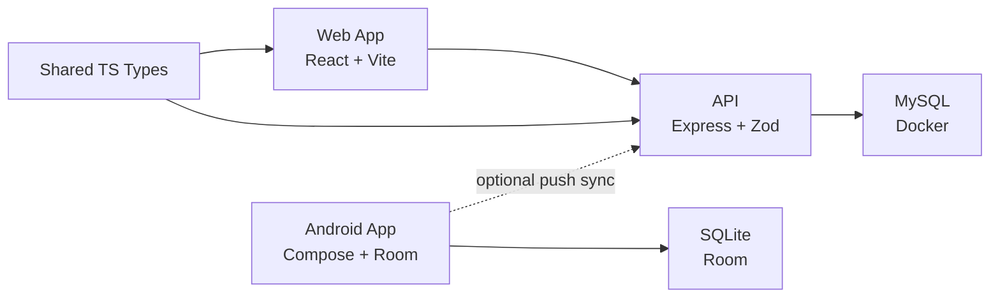
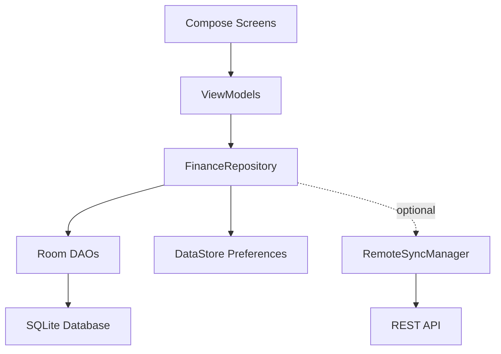
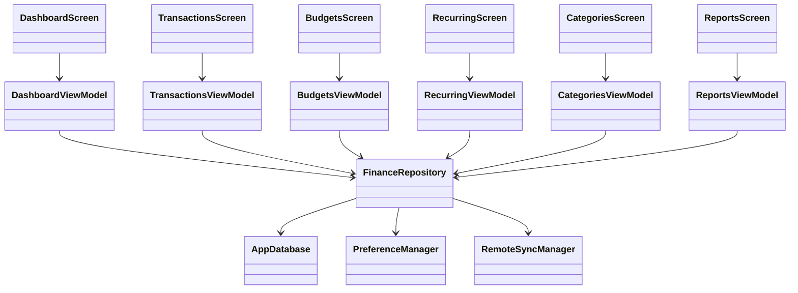
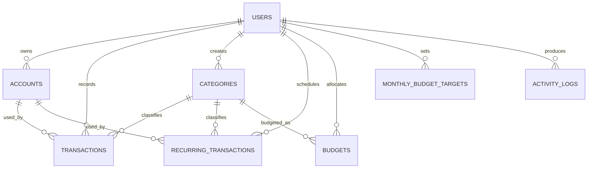

# Personal Finance Tracker

Personal Finance Tracker is a multi-client personal finance project with:

- a web app in `apps/web`
- a REST API in `apps/api`
- a native Android app in `apps/android`

The web stack is API-backed with MySQL. The Android app is local-first with Room/SQLite and optional push-only sync to the existing backend.

## Product Scope

Current finance domains:

- transactions
- recurring schedules
- monthly budgets
- monthly budget targets
- categories
- activity history
- dashboard summaries
- monthly reports

## Repository Layout

```text
personal-finance-tracker/
|-- apps/
|   |-- api/                  Node.js + Express API
|   |-- web/                  React web application
|   `-- android/              Kotlin + Compose Android application
|-- database/
|   |-- migrations/           MySQL schema and seed history
|   `-- schema.sql            Schema snapshot
|-- packages/
|   `-- shared/               Shared TypeScript types
|-- scripts/                  Local startup, stop, backup, restore, tailscale helpers
|-- docker-compose.yml        MySQL local infrastructure
`-- README.md
```

## Current App State

### Web

- month-aware dashboard
- full transaction CRUD
- search, filter, pagination, bulk delete, bulk recategorize
- recurring schedule management
- budget target and category budgets
- category archive, restore, replacement-based delete
- reports and CSV export

### Android

- local-first persistence with Room and DataStore
- dashboard, transactions, recurring, budgets, categories, reports
- add/edit/delete flows for all core entities
- shared app-wide month control across dashboard, transactions, budgets, and reports
- compact transaction filters with search and advanced filters
- bulk delete and bulk recategorize for transactions
- copy budgets to next month without copying usage
- copy recurring schedules to next month with duplicate protection
- JSON backup export
- CSV transaction export
- CSV report export, including monthly breakdown and category drill-down transactions
- optional push-only sync to the existing API
- dark/light theme toggle
- native Android date pickers for transaction and recurring editors, with quick date actions
- budget-vs-actual reporting, trailing multi-month comparison, and report drill-down views
- animated month transitions, animated list placement, and animated shell navigation
- unsaved-change protection on full-screen transaction and recurring editors

## Tech Stack

### Web

- React
- TypeScript
- Vite
- Tailwind CSS
- TanStack Query
- React Router
- Recharts

### API

- Node.js
- Express
- TypeScript
- Zod
- mysql2

### Android

- Kotlin
- Jetpack Compose
- Material 3
- Room
- DataStore
- ViewModel
- Coroutines
- OkHttp

### Data

- MySQL 8 for web and API
- SQLite for Android

## Architecture

### System Diagram



### Android Layer Diagram



### UML Style Component View



### Entity Relationship Diagram



## Core Data Model

Main persisted entities:

- `users`
- `accounts`
- `categories`
- `transactions`
- `recurring_transactions`
- `budgets`
- `monthly_budget_targets`
- `activity_logs`

The Android app persists equivalent structures in Room. Budget usage is derived from transactions and is not copied when copying budget baselines across months.

## Feature Notes

### Shared month model

- web keeps the selected month in app state and URL-driven navigation
- Android keeps the selected month in DataStore
- dashboard, transactions, budgets, and reports read from the same selected month

### Android persistence model

- primary storage is local Room/SQLite
- sync is optional and manual
- current sync mode pushes local data to the API
- Android remains usable without the backend

### Current limitations

- no authentication
- Android sync is not full bidirectional sync
- no conflict resolution across web and Android
- no encrypted local database yet
- no cloud backup flow yet

## Local Development

### Prerequisites

- Node.js 20+
- npm 10+
- Docker with Compose
- Android Studio for Android work
- Java 17

### Web and API startup

```bash
npm install
bash scripts/start-dev.sh
```

Stop everything:

```bash
bash scripts/stop-dev.sh
```

### Android startup

Open `apps/android` in Android Studio and run the app on:

- an emulator, or
- a spare Android device

## Android Release Artifact

The committed Android release artifact lives in:

- `releases/android/personal-finance-tracker-android-release.apk`

Local Android build outputs under `apps/android/app/build/` remain ignored so development artifacts are not pushed accidentally. Only curated release files copied into `releases/android/` are tracked.

For development, prefer the emulator. Many banking and security-sensitive apps react to developer mode, USB debugging, or sideloaded debug builds on a primary phone.

## Testing

### Web and API

```bash
npm test
npm run lint
npm run build
```

### Android

From `apps/android`:

```bash
./gradlew :app:assembleDebug
./gradlew :app:testDebugUnitTest
./gradlew :app:assembleRelease
```

## Release Build

The Android app supports property-based release signing.

1. Copy `apps/android/keystore.properties.example` to `apps/android/keystore.properties`
2. Create or place your release keystore in `apps/android/`
3. Fill in:
   - `storeFile`
   - `storePassword`
   - `keyAlias`
   - `keyPassword`
4. Build:

```bash
cd apps/android
./gradlew :app:assembleRelease
```

Generated APK:

- signed release: `apps/android/app/build/outputs/apk/release/app-release.apk`
- unsigned release when no keystore is configured: `apps/android/app/build/outputs/apk/release/app-release-unsigned.apk`

Do not commit:

- `apps/android/keystore.properties`
- any `.jks` or `.keystore` file

Back up the release keystore outside the repo. Losing it blocks future updates to the installed app.

## API Surface

- `GET /api/health`
- `GET /api/dashboard?month=YYYY-MM`
- `GET /api/transactions`
- `GET /api/transactions/export`
- `POST /api/transactions`
- `PUT /api/transactions/:id`
- `DELETE /api/transactions/:id`
- `POST /api/transactions/bulk-delete`
- `POST /api/transactions/bulk-recategorize`
- `GET /api/recurring-transactions`
- `POST /api/recurring-transactions`
- `PUT /api/recurring-transactions/:id`
- `DELETE /api/recurring-transactions/:id`
- `POST /api/recurring-transactions/sync`
- `GET /api/categories`
- `POST /api/categories`
- `PUT /api/categories/:id`
- `DELETE /api/categories/:id`
- `PUT /api/categories/:id/archive`
- `GET /api/accounts`
- `GET /api/monthly-budget`
- `PUT /api/monthly-budget`
- `GET /api/budgets`
- `POST /api/budgets`
- `PUT /api/budgets/:id`
- `DELETE /api/budgets/:id`
- `GET /api/reports/overview`
- `GET /api/activity`

## Before Pushing To GitHub

Verify these are not committed:

- `.env`
- IDE folders like `.idea/`
- Android local files like `local.properties`
- release keystores and signing properties
- build outputs and generated APKs
- database dumps and backup archives

## Missing But Worth Adding

For long-term use, the next useful additions are:

- encrypted local storage or at least sensitive-data threat notes
- proper Android import and restore flow, not just export
- full sync strategy with conflict handling
- versioned Android Room migrations instead of destructive fallback only
- screenshots for web and Android in the README
- GitHub Actions for test and build verification
